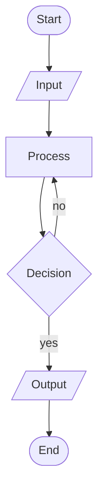
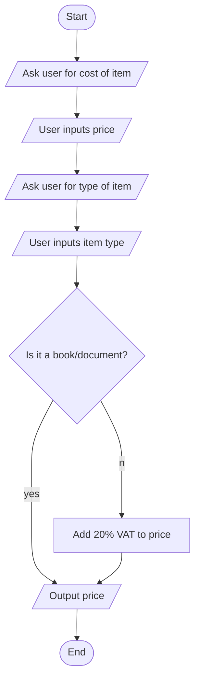

#date/27-09-23 

Anaconda Navigator --> see all Python IDEs

## Programming Steps

1. Define + analyse + understand the problem
    - "Think twice, code once"
2. Design and algorithm development
    - Pseudo-code
    - Flowcharts
    - Consider requirements: efficiency, economy, security, ...
3. Implementation (coding)
4. Testing
    - check if it works as expected
5. Maintenance
    - Once the software is up and running, monitor for any bugs
    - Maintainable code: clean, high quality, well-documented

## Algorithmic Thinking

Decomposition: break problem down into smaller, more manageable parts
Pattern recognition: analyse data and identify similarities
Abstraction: identify the most relevant information needed to solve the problem and eliminate the irrelevant details
Algorithmic thinking: develop a step-by-step process to solve the problem

### Pseudo-code

- Text in English

```pseudocode
START

OUTPUT "Enter item price: "
price <-- INPUT

OUTPUT "Enter item type: "
type <-- INPUT

IF NOT (type = "book" OR type = "document")
    price = price * 1.2
END IF
OUTPUT price

END
```

### Flowchart

- Graphical representation
- There is a "language"/ruleset:




